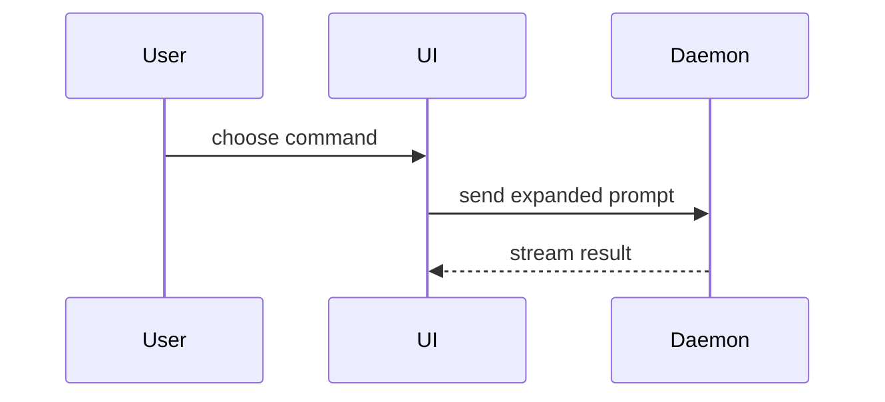

# Skill: show-me（wiki 可视化 — MUST follow）

Help the reader understand each module visually. Skip fluff. Pick the **smallest** view that makes the key point clear.

When writing wiki pages, prefer concise visuals next to short prose:

- **Logic / algorithm** → text pseudocode block:

```text
on(save)
  if content is unchanged
    return cached result
  write new content
  return fresh result
```

- **Runtime control flow** → call tree:

```text
submitForm
  createSession
    persistPrompt
    launchAgent
  navigateToSession
```

- **Module / file responsibility** → shallow file tree:

```text
src/
├── commands/       # parses user actions
├── sessions/       # owns session state
└── transport/      # sends API requests
```

- **Component interaction / data flow** → Mermaid (keep ~5–10 nodes):



- **What changed** (when the surrounding shape already exists) → diff blocks (component / file layout / call tree / control flow).

- Show the **full** code/shape block when most of it is new, or when omitting context would hide ownership or order.

### Guidance

- Place each visual next to the short text it supports.
- Keep only the calls, files, states, and boundaries needed for this module.
- You may use one of these forms, or several; do not use all of them on every page.
- Prefer real symbol names and paths from the graph/evidence over invented labels.
